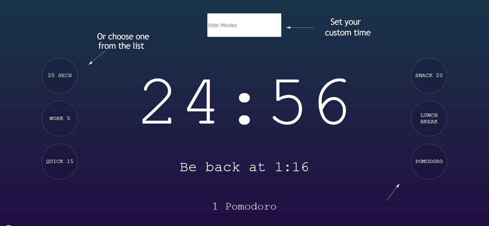

   

# Timers site made with Vanilla JS

## Live version

Check out and use the live [here](https://timerscd.netlify.app/) 📡

## Contributing 🖇️

Any contributions are highly appreciated. There are two things you can do:

1. Create an issue explaining your idea.
2. Fork the project and submit a Pull Request with your idea already developed explaining it in detail.

## License 📄

This project is [MIT](https://choosealicense.com/licenses/mit/) licenced

⌨️ with ❤️ by [Ukliz](https://github.com/Uklizdev) 😊
